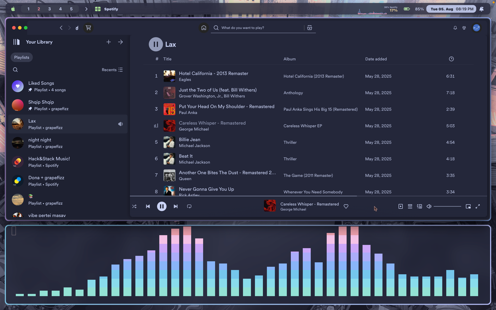
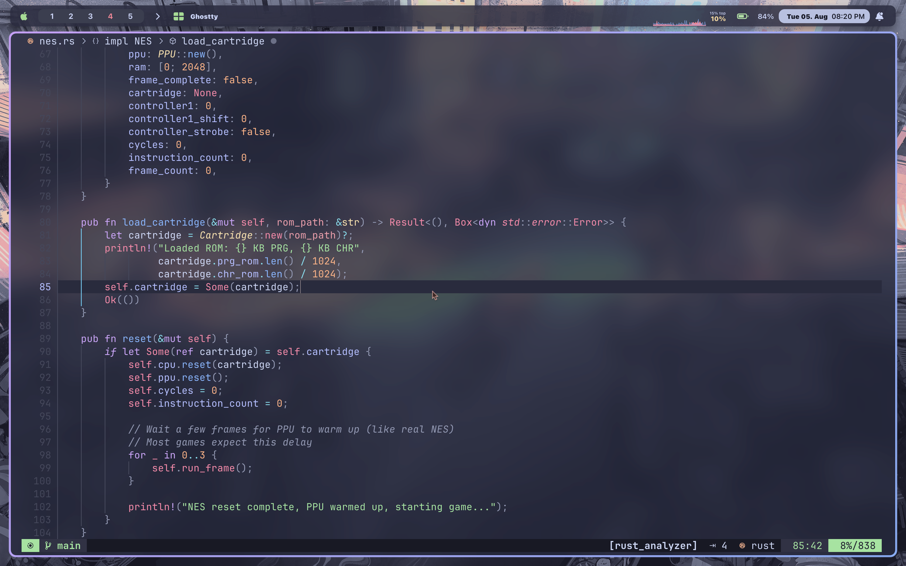

<h1 align="center">

    <br>
        macOS dotfiles managed with Nix
    <br>
    
</h1>


## Setup

> [!IMPORTANT]
> **Back up your .config folder before installation**

1. Install Nix:
   ```bash
   curl --proto '=https' --tlsv1.2 -sSf -L https://install.determinate.systems/nix | sh -s -- install
   ```

2. Clone repo:
   ```bash
   git clone https://github.com/grapefizz/dots.git
   cd dotfiles
   ```

3. Apply dots:
    ```bash
    home-manager switch --flake .#Ari
    sudo darwin-rebuild switch --flake .#Ari-MacBook
    ```
    or
    ```bash
    home-manager switch --flake .#Ari
    sudo nix run nix-darwin -- switch --flake .#Ari-MacBook
    ```
  > [!IMPORTANT]  
  > You will need to enter your password ***at least once***.

## Tools

- yabai (window manager)
- skhd (hotkeys)
- sketchybar (status bar)
- ghostty (terminal)
- neovim (editor)



